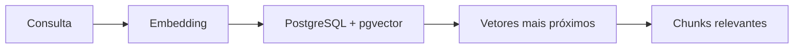
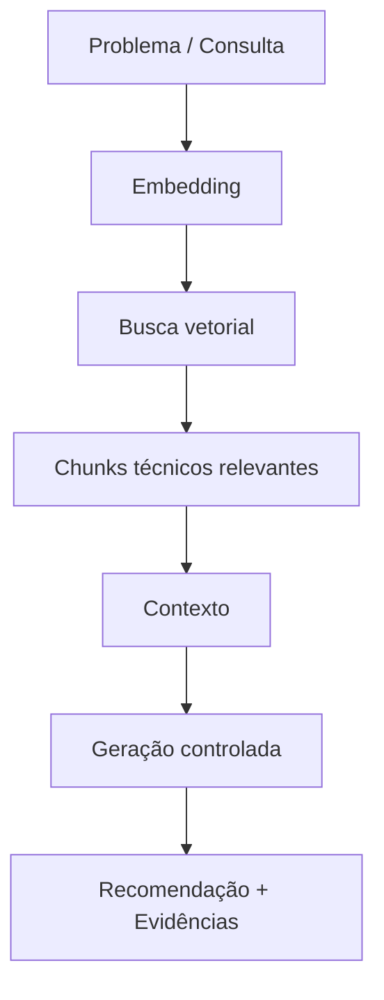
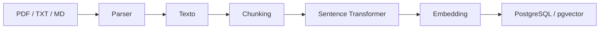
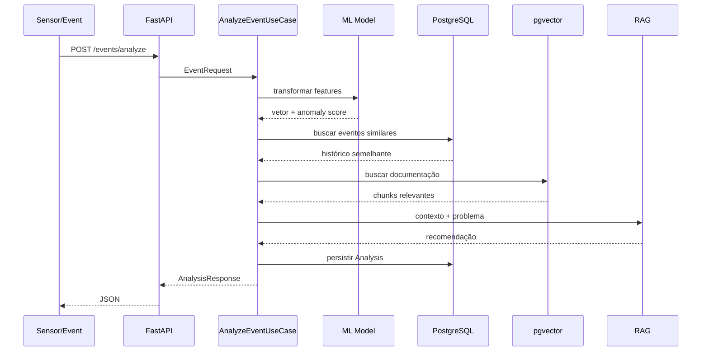

# Manutenção Prescritiva Enterprise — FIESC/SENAI SC

Solução **Full Stack + Inteligência Artificial** desenvolvida para o case de Manutenção Prescritiva da FIESC/SENAI SC.

A plataforma combina:

- dados históricos de sensores industriais;
- Machine Learning para detecção de anomalias;
- busca de eventos históricos semelhantes;
- documentação técnica;
- embeddings e busca vetorial;
- RAG;
- API REST;
- dashboard interativo;
- PostgreSQL + pgvector;
- Docker;
- arquitetura baseada em Clean Architecture, DDD e SOLID.

> **Regra crítica do domínio:** o sistema não deve recomendar uma intervenção quando não existe documentação técnica suficiente relacionada ao problema identificado. Nesse cenário, a resposta deve ser controlada e solicitar o cadastro de documentação adequada.

---

# 1. Problema

A manutenção preditiva procura identificar comportamentos que possam indicar falhas antes que ocorram paradas não planejadas.

A manutenção prescritiva vai além.

Ela procura responder:

> **Existe um comportamento anormal? Já aconteceu algo semelhante? E, com base no conhecimento técnico disponível, o que deve ser feito?**

A solução construída combina três fontes principais de informação:

```text
Dados de sensores
      +
Histórico operacional
      +
Documentação técnica
      ↓
Análise Prescritiva
````

---

# 2. Preditiva × Prescritiva

```text
MANUTENÇÃO PREDITIVA

"O que provavelmente está acontecendo?"

        ↓

detecção de anomalias
tendências
similaridade histórica


MANUTENÇÃO PRESCRITIVA

"O que deve ser feito?"

        ↓

documentação técnica
procedimentos
evidências
recomendações
```

A solução implementa os dois conceitos no mesmo fluxo.

---

# 3. Arquitetura da solução

```mermaid
+---------------------------+
| Sensores / SCADA / PLC    |
+-------------+-------------+
              |
              v
+---------------------------+
|         FastAPI           |
|      Presentation         |
+-------------+-------------+
              |
              v
+---------------------------+
|        Application        |
|         Use Cases         |
|                           |
| - Analyze Event           |
| - Ingest CSV              |
| - Ingest Documents        |
| - Chat / Recommendation   |
+-------------+-------------+
              |
              v
+---------------------------+
|          Domain           |
|                           |
| - SensorEvent             |
| - Analysis                |
| - Recommendation          |
| - Regras de negócio       |
| - Ports / Contracts       |
+-------------+-------------+
              |
              v
+-------------------------------------------------------+
|                    Infrastructure                     |
|                                                       |
| +-------------+ +-------------+ +------------------+ |
| | PostgreSQL  | | ML / sklearn| | Embeddings       | |
| | + pgvector  | |             | | SentenceTransf.  | |
| +-------------+ +-------------+ +------------------+ |
|                                                       |
| +-------------+ +-------------+ +------------------+ |
| | Redis       | | PDF Parser  | | RAG / LLM        | |
| +-------------+ +-------------+ +------------------+ |
+-------------------------------------------------------+
              |
              v
+---------------------------+
|     Streamlit Dashboard   |
+---------------------------+

---

# 4. Clean Architecture

A aplicação foi organizada para reduzir o acoplamento entre regra de negócio e tecnologias externas.

```mermaid
+------------------------------------------------------+
|                    PRESENTATION                      |
|                                                      |
|              FastAPI / Streamlit                     |
+--------------------------+---------------------------+
                           |
                           v
+------------------------------------------------------+
|                    APPLICATION                       |
|                                                      |
|                Use Cases / DTOs                      |
|                                                      |
|      Orquestra os fluxos da aplicação                |
+--------------------------+---------------------------+
                           |
                           v
+------------------------------------------------------+
|                       DOMAIN                         |
|                                                      |
|      Entidades / Regras / Serviços / Ports           |
|                                                      |
|           Núcleo da regra de negócio                 |
+------------------------------------------------------+

                           ^
                           |
                           |
+--------------------------+---------------------------+
|                  INFRASTRUCTURE                      |
|                                                      |
| PostgreSQL | pgvector | Redis | ML | Embeddings      |
| SQLAlchemy | PDF Parser | LLM | Observabilidade      |
+------------------------------------------------------+
```

A regra principal é:

> **O domínio não deve depender de FastAPI, PostgreSQL, Redis ou scikit-learn.**

Essas tecnologias são detalhes de infraestrutura.

---

# 5. Estrutura do projeto

```text
app/
├── domain/
│   ├── entities.py
│   ├── services.py
│   ├── ports.py
│   └── constants.py
│
├── application/
│   ├── use_cases.py
│   ├── chat_use_case.py
│   ├── dtos.py
│   └── unit_of_work.py
│
├── infrastructure/
│   ├── db.py
│   ├── models.py
│   ├── repositories.py
│   ├── ml.py
│   ├── embeddings.py
│   ├── documents.py
│   ├── llm.py
│   ├── cache.py
│   └── observability.py
│
└── presentation/
    └── api/
        ├── main.py
        ├── schemas.py
        └── dependencies.py

dashboard/
└── app.py

scripts/
├── train_models.py
├── ingest_csv.py
├── ingest_documents.py
├── smoke_test.py
└── export_openapi.py

alembic/
└── versions/

infra/
├── init.sql
├── prometheus.yml
└── nginx.conf

tests/
docs/
```

---

# 6. Conceitos arquiteturais utilizados

## Domain-Driven Design — DDD

O domínio representa o problema que está sendo resolvido.

Neste projeto, conceitos como:

```text
SensorEvent
Analysis
Document
Recommendation
Fault
```

fazem parte do domínio.

Tecnologias como:

```text
FastAPI
PostgreSQL
Redis
Docker
scikit-learn
```

não fazem parte do domínio.

São implementações utilizadas para suportá-lo.

---

## SOLID

### Single Responsibility Principle

Cada componente possui responsabilidade específica.

```text
DocumentParser
    → extrair texto

EmbeddingService
    → gerar embeddings

Repository
    → persistência

SensorModel
    → Machine Learning

Use Case
    → orquestração
```

### Dependency Inversion

Os casos de uso dependem de contratos, não diretamente da infraestrutura.

```mermaid
SEM INVERSÃO DE DEPENDÊNCIA
---------------------------

+-----------------------+
| AnalyzeEventUseCase   |
+-----------+-----------+
            |
            v
+-----------------------+
| SQLAlchemy            |
+-----------+-----------+
            |
            v
+-----------------------+
| PostgreSQL            |
+-----------------------+

Problema:
o Use Case conhece diretamente
uma tecnologia específica.

COM INVERSÃO DE DEPENDÊNCIA
---------------------------

+-----------------------+
| AnalyzeEventUseCase   |
+-----------+-----------+
            |
            v
+-----------------------+
| EventRepository       |
|     CONTRATO          |
+-----------+-----------+
            ^
            |
            |
+-----------+-----------+
| SqlAlchemyEventRepo   |
+-----------+-----------+
            |
            v
+-----------------------+
| PostgreSQL            |
+-----------------------+

```

Assim é possível substituir uma implementação sem alterar a regra central da aplicação.

---

# 7. Stack

| Camada               | Tecnologia                      |
| -------------------- | ------------------------------- |
| Linguagem            | Python 3.12                     |
| API                  | FastAPI                         |
| Validação            | Pydantic v2                     |
| Banco                | PostgreSQL 16                   |
| Vetores              | pgvector                        |
| ORM                  | SQLAlchemy                      |
| Migrations           | Alembic                         |
| ML                   | scikit-learn                    |
| Pré-processamento    | StandardScaler                  |
| Anomalias            | Isolation Forest                |
| Embeddings           | Sentence Transformers           |
| Modelo de embeddings | `all-MiniLM-L6-v2`              |
| RAG                  | Retrieval-Augmented Generation  |
| Cache/infra          | Redis                           |
| Dashboard            | Streamlit + Plotly              |
| Containers           | Docker / Docker Compose         |
| CI/CD                | GitHub Actions                  |
| Observabilidade      | Health checks, logs, Prometheus |
| Testes               | pytest                          |

---

# 8. Pipeline de Machine Learning

```mermaid
+-------------------+
|    banner.csv     |
+---------+---------+
          |
          v
+-------------------+
| 23 Sensor Features|
+---------+---------+
          |
          v
+-------------------+
|  StandardScaler   |
|                   |
| Padronização das  |
| variáveis         |
+---------+---------+
          |
          v
+-------------------+
| Isolation Forest  |
|                   |
| Detecção de       |
| anomalias         |
+---------+---------+
          |
          v
+---------------------------+
| Artefatos treinados       |
|                           |
| sensor_scaler.joblib      |
| isolation_forest.joblib   |
+---------------------------+
```

## StandardScaler

As variáveis dos sensores possuem escalas diferentes.

Exemplo:

```text
temperatura = 76
vibração = 0.08
frequência = 1000
```

O StandardScaler coloca as features em escalas comparáveis.

Conceitualmente:

```text
z = (x - média) / desvio padrão
```

---

# 9. Isolation Forest

O Isolation Forest é utilizado para **detecção de anomalias**.

Ele não é um classificador de defeitos.

A ideia é que observações anormais sejam mais fáceis de isolar que observações pertencentes às regiões mais densas do conjunto de dados.

```text
Normal

 ● ● ● ●
● ● ● ● ●
 ● ● ● ●


                         X

                    Anomalia
```

> Isolation Forest responde principalmente:
> **"Este comportamento é diferente do padrão?"**

Ele não responde diretamente:

> "Esta é necessariamente uma falha de rolamento."

Classificação e detecção de anomalias são problemas diferentes.

---

# 10. Embeddings

Um embedding é uma **representação vetorial** de uma informação.

Exemplo:

```text
"rotor inclinado"

       ↓

Sentence Transformer

       ↓

[0.17, -0.31, 0.72, ...]
```

Textos semanticamente semelhantes tendem a gerar vetores próximos.

```text
"rotor inclinado"

≈

"problema de inclinação do rotor"
```

O modelo utilizado é:

```text
sentence-transformers/all-MiniLM-L6-v2
```

que gera vetores de 384 dimensões.

---

# 11. pgvector

`pgvector` é uma extensão do PostgreSQL que adiciona suporte a armazenamento e consulta de vetores.

Com isso, o mesmo banco armazena:

```text
eventos
documentos
análises
metadados
embeddings
```

O pgvector é utilizado para localizar conteúdos semanticamente semelhantes.



A escolha evita a introdução de um banco vetorial adicional para o volume deste projeto.

---

# 12. RAG

RAG significa:

```text
Retrieval-Augmented Generation
```

ou geração aumentada por recuperação de informação.

O fluxo implementado é:



A principal vantagem é que a recomendação pode ser fundamentada em documentação real.

---

# 13. Por que RAG e não Fine-Tuning?

O conhecimento técnico utilizado na recomendação está nos documentos da empresa.

Documentos podem mudar.

Com RAG:

```text
Novo PDF
   ↓
extração
   ↓
chunk
   ↓
embedding
   ↓
pgvector
```

O documento passa a fazer parte da base de conhecimento sem necessidade de retreinamento do LLM.

Além disso, o RAG permite rastreabilidade das fontes utilizadas.

---

# 14. Pipeline documental



---

# 15. Fluxo completo da análise



---

# 16. Dados reais utilizados

O projeto foi validado com o dataset oficial.

Resultados da ingestão:

```text
166.796 eventos
```

Configuração utilizada:

```text
Batch size: 2.000 registros
```

Resultado:

```text
84 lotes
0 lotes com falha
246,16 segundos
677,6 registros/segundo
```

---

# 17. Otimização de performance

A implementação inicial executava aproximadamente:

```text
1 registro
    ↓
INSERT
    ↓
COMMIT
```

para cada evento.

Com 166.796 registros, isso poderia resultar em aproximadamente:

```text
166.796 transações
```

A ingestão foi refatorada para:

```text
2.000 registros
       ↓
transformação vetorizada
       ↓
bulk INSERT
       ↓
1 COMMIT
```

Resultado:

```text
166.796 registros
        ↓
84 transações
```

Essa mudança reduziu drasticamente os round-trips e o custo transacional.

---

# 18. Problemas encontrados durante o desenvolvimento

## Ingestão linha a linha

Problema:

```text
commit por registro
```

Solução:

```text
batch processing
```

---

## StandardScaler

Problema:

```text
X does not have valid feature names
```

O scaler havia sido treinado usando DataFrame, enquanto a inferência estava utilizando arrays.

Solução:

```text
DataFrame
+
mesmas SENSOR_FEATURES
+
mesma ordem
```

---

## PDF sem camada textual

Um dos documentos possuía apenas:

```text
36 caracteres
```

extraíveis.

O pipeline rejeitou corretamente o documento:

```text
Documento sem conteúdo textual.
```

A evolução planejada é utilizar OCR automaticamente quando a extração textual for insuficiente.

---

## Documento órfão

A primeira tentativa de ingestão criou o registro do documento antes da criação dos chunks.

O resultado foi:

```text
Doc1.pdf
0 chunks
```

Isso demonstrou a importância de operações atômicas:

```text
BEGIN

document
chunks
embeddings

COMMIT
```

ou:

```text
ROLLBACK
```

---

# 19. Banco de dados

Principais estruturas:

```text
events
documents
document_chunks
analyses
```

Responsabilidades:

```text
events
→ histórico dos sensores

documents
→ documentos técnicos

document_chunks
→ segmentos + embeddings

analyses
→ resultado das análises
```

---

# 20. Segurança

Para o case, endpoints protegidos podem utilizar API Key.

Em um ambiente corporativo, a evolução recomendada seria:

```text
OIDC
+
OAuth2
+
RBAC
```

### Autenticação

```text
Quem é você?
```

### Autorização

```text
O que você pode fazer?
```

### RBAC

Controle de permissões baseado em papéis.

Exemplo:

```text
ADMIN
├── gerenciar usuários
├── documentos
└── modelos

ENGENHEIRO
├── análises
└── documentos

OPERADOR
└── consultas
```

---

# 21. Observabilidade

A solução possui:

```text
/health
/health/live
/health/ready
```

e integração preparada para:

```text
Prometheus
logs estruturados
métricas
```

Em produção também seriam monitorados:

```text
latência
throughput
taxa de erro
uso de cache
tempo de consulta vetorial
distribuição de anomaly score
data drift
concept drift
```

---

# 22. Execução

Crie o arquivo de ambiente:

```bash
cp .env.example .env
```

Suba os serviços:

```bash
docker compose up --build -d
```

Verifique:

```bash
docker compose ps
```

Acessos:

* API / Swagger: [http://localhost:8000/docs](http://localhost:8000/docs)
* Dashboard: [http://localhost:8501](http://localhost:8501)
* Prometheus: [http://localhost:9090](http://localhost:9090)
* PostgreSQL: localhost:5432

---

# 23. Preparação dos dados

Arquivo oficial:

```text
data/banner.csv
```

Documentos técnicos:

```text
data/documents/
```

Treinamento:

```bash
docker compose exec api python -m scripts.train_models \
  --csv data/banner.csv
```

Carga dos eventos:

```bash
docker compose exec api python -m scripts.ingest_csv \
  --csv data/banner.csv \
  --batch-size 2000 \
  --truncate
```

Carga documental:

```bash
docker compose exec api python -m scripts.ingest_documents \
  --directory data/documents
```

---

# 24. Teste de análise

```bash
curl -X POST \
  http://localhost:8000/api/v1/events/analyze \
  -H "Content-Type: application/json" \
  -H "X-API-Key: change-this-api-key" \
  --data-binary "@data/sample_event.json"
```

---

# 25. Resultado validado

Uma análise real utilizando o evento:

```text
cocked_rotor_2
```

encontrou:

```text
20 eventos históricos similares
```

e recuperou documentação correspondente ao procedimento de:

```text
Rotor Inclinado / Cocked Rotor
```

A análise foi persistida na tabela:

```text
analyses
```

e o endpoint retornou:

```text
HTTP 200
```

---

# 26. CI/CD

O projeto possui workflow GitHub Actions preparado para executar:

```text
lint
type checking
testes
build
```

O objetivo é impedir que alterações quebradas sejam integradas ao repositório.

---

# 27. Testes

A estratégia contempla:

```text
Unit Tests
Contract Tests
Integration Tests
Smoke Tests
```

Ferramenta:

```text
pytest
```

---

# 28. Ambiente industrial

Uma arquitetura de produção poderia evoluir para:

```mermaid
CHÃO DE FÁBRICA / OT
================================================

+---------+     +---------+     +---------+
| Sensor  |     |   PLC   |     |  SCADA  |
+----+----+     +----+----+     +----+----+
     |               |               |
     +---------------+---------------+
                     |
                     v
            +------------------+
            | Industrial       |
            | Gateway / Edge   |
            +--------+---------+
                     |
                     v

DMZ / INTEGRAÇÃO
================================================

            +------------------+
            | MQTT / Kafka     |
            | Event Broker     |
            +--------+---------+
                     |
                     v

TI / APLICAÇÃO
================================================

            +------------------+
            | FastAPI          |
            | Inference API    |
            +--------+---------+
                     |
        +------------+------------+
        |            |            |
        v            v            v
+------------+ +-----------+ +-----------+
| PostgreSQL | | ML Model  | | RAG       |
| + pgvector | |           | |           |
+------------+ +-----------+ +-----------+
        |
        v
+------------------+
| Observabilidade  |
| Prometheus       |
| Logs / Grafana   |
+--------+---------+
         |
         v

USUÁRIO
================================================

+----------------------------+
| Dashboard / Manutenção     |
| Engenharia / Operação      |
+----------------------------+
```

A integração entre chão de fábrica e ambiente corporativo deve considerar:

* segregação de redes;
* autenticação de máquinas;
* TLS;
* auditoria;
* disponibilidade;
* tratamento de eventos offline.

---

# 29. Limitações e roadmap

A solução está funcional para demonstração técnica, mas as principais evoluções para produção incluem:

### Dados

* normalização dos rótulos de `fault`;
* validação de qualidade;
* tratamento de drift.

### Documentos

* OCR integrado;
* governança documental;
* metadados por tipo de falha.

### RAG

* avaliação com Precision@K;
* Recall@K;
* MRR;
* reranking;
* filtros por categoria.

### MLOps

* versionamento de modelos;
* model registry;
* monitoramento de drift;
* retreinamento controlado.

### Segurança

* OIDC;
* OAuth2;
* RBAC;
* secret manager;
* TLS;
* auditoria.

### Infraestrutura

* alta disponibilidade;
* backups;
* disaster recovery;
* Kubernetes caso a escala justifique.

---

# 30. Status validado

A execução local foi efetivamente validada com:

```text
PostgreSQL 16             OK
pgvector                  OK
Redis                     OK
Alembic                   OK
FastAPI                   OK
Swagger                   OK
Health checks             OK
Modelo de embeddings      OK
Ingestão documental       OK
Ingestão CSV              OK
Busca vetorial            OK
Busca histórica           OK
RAG                       OK
Persistência Analysis     OK
```

Dados processados:

```text
166.796 eventos
46 chunks documentais
```

Performance observada na ingestão:

```text
~677,6 registros/segundo
```

---

# 31. Principais decisões técnicas

| Decisão               | Justificativa                                                      |
| --------------------- | ------------------------------------------------------------------ |
| FastAPI               | API Python tipada, rápida e integrada ao ecossistema ML            |
| PostgreSQL            | Banco relacional robusto e transacional                            |
| pgvector              | Busca vetorial sem banco adicional                                 |
| Isolation Forest      | Detecção de anomalias sem depender de classificação supervisionada |
| StandardScaler        | Padronização das features                                          |
| Sentence Transformers | Embeddings locais e eficientes                                     |
| RAG                   | Atualização de conhecimento sem fine-tuning                        |
| Streamlit             | Rapidez para dashboard técnico                                     |
| Docker                | Reprodutibilidade                                                  |
| Clean Architecture    | Baixo acoplamento                                                  |
| DDD                   | Domínio no centro do design                                        |
| Repository            | Abstração da persistência                                          |
| Alembic               | Versionamento do schema                                            |
| Batch ingestion       | Performance para alto volume                                       |

---

# 32. Resumo

A solução implementa um pipeline completo:

```text
Sensores
   ↓
Machine Learning
   ↓
Detecção de anomalias
   ↓
Busca histórica
   ↓
Embeddings
   ↓
pgvector
   ↓
RAG
   ↓
Documentação técnica
   ↓
Recomendação
   ↓
Evidências
```

O projeto demonstra não apenas integração de IA, mas também conceitos de:

```text
arquitetura de software
engenharia de dados
machine learning
APIs
bancos vetoriais
RAG
DevOps
observabilidade
performance
segurança
```

com uma arquitetura preparada para evolução em ambiente industrial.

```
