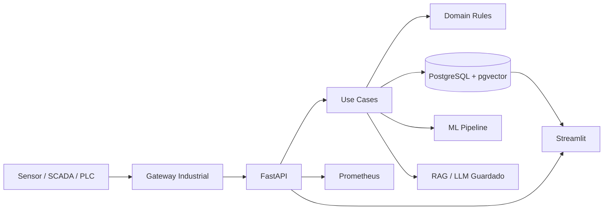

# Manutenção Prescritiva Enterprise — FIESC/SENAI SC

Solução **full stack + IA** para o case de Manutenção Prescritiva, pronta para demonstração técnica com **API, PostgreSQL, pgvector, Streamlit, RAG, dashboard, Docker, migrations, testes, CI/CD, observabilidade e arquitetura industrial**.

> Regra crítica do domínio: o sistema **não recomenda manutenção quando não existe documentação técnica relacionada ao defeito**. Nesse caso, a resposta é controlada, sem alucinação, e solicita o cadastro de novo documento.

## Stack

| Camada | Tecnologia |
|---|---|
| API | Python 3.12, FastAPI, Pydantic v2 |
| Banco | PostgreSQL 16 + pgvector + JSONB + Full Text Search |
| IA | scikit-learn, Isolation Forest, PCA, sentence-transformers, RAG |
| LLM | modo template seguro ou OpenAI-compatible/Ollama |
| Dashboard | Streamlit + Plotly |
| Arquitetura | Clean Architecture, DDD, SOLID, Unit of Work, Repository Pattern |
| Deploy | Docker, Docker Compose, Nginx opcional |
| Observabilidade | health/readiness, Prometheus, OpenTelemetry hooks, logs JSON |
| CI/CD | GitHub Actions com lint, type-check, tests e build Docker |
| Qualidade | pytest, contract tests, unit tests, integration-ready |

## Funcionalidades

- Recebimento de evento novo em JSON.
- Validação das 23 métricas de vibração.
- Classificação de estado operacional versus problema.
- Score de anomalia por Isolation Forest.
- Vetorização dos sensores e busca de eventos similares com pgvector.
- Frequência de ocorrência e distribuição temporal.
- Ingestão de documentos PDF/TXT/MD.
- Chunking, embeddings e busca semântica.
- Busca híbrida: vetor + texto + priorização por defeito.
- RAG com evidências.
- Controle anti-alucinação.
- Dashboard interativo.
- Chat técnico baseado na documentação.
- Endpoint de feedback humano para evolução da base.
- Export OpenAPI.
- Migrations Alembic.
- Arquitetura para ambiente industrial.

## Arquitetura



## Estrutura

```text
app/
├── domain/                 # entidades, value objects, serviços e portas
├── application/            # use cases, DTOs, Unit of Work
├── infrastructure/         # banco, ML, embeddings, LLM, cache, observabilidade
└── presentation/api/       # FastAPI, schemas, routers
dashboard/                  # Streamlit enterprise
scripts/                    # carga, treino, export swagger, seed demo
alembic/                    # migrations
infra/                      # nginx, prometheus, grafana provisioning
docs/                       # arquitetura, deploy, apresentação, decisões técnicas
tests/                      # testes unitários, contrato e integração-ready
```

## Execução rápida

```bash
cp .env.example .env
docker compose up --build -d
```

Acessos:

- API: http://localhost:8000/docs
- Dashboard: http://localhost:8501
- Prometheus: http://localhost:9090
- PostgreSQL: localhost:5432

## Dados

Coloque o CSV oficial em:

```text
data/banner.csv
```

Coloque documentos técnicos em:

```text
data/documents/
```

Depois execute:

```bash
make migrate
make bootstrap-data
```

Ou manualmente:

```bash
docker compose exec api alembic upgrade head
docker compose exec api python -m scripts.train_models --csv data/banner.csv
docker compose exec api python -m scripts.ingest_csv --csv data/banner.csv
docker compose exec api python -m scripts.ingest_documents --directory data/documents
```

## Teste de análise

```bash
curl -X POST http://localhost:8000/api/v1/events/analyze \
  -H "Content-Type: application/json" \
  -d @data/sample_event.json
```

## Modos de LLM

### Seguro sem LLM externo

```env
LLM_PROVIDER=template
```

### Ollama ou endpoint OpenAI-compatible

```env
LLM_PROVIDER=openai_compatible
LLM_BASE_URL=http://host.docker.internal:11434/v1
LLM_API_KEY=ollama
LLM_MODEL=qwen2.5:7b-instruct
```

Mesmo usando LLM, a resposta é limitada aos trechos recuperados.

## Scripts úteis

```bash
make up
make logs
make migrate
make test
make lint
make format
make export-openapi
make demo-seed
```

## Entregáveis incluídos

- Código fonte completo.
- Docker Compose.
- `.env.example`.
- Migrations Alembic.
- Dashboard Streamlit.
- API Swagger/OpenAPI.
- Documentação técnica.
- Roteiro de apresentação.
- Deck PowerPoint em `docs/apresentacao_enterprise.pptx`.
- Coleção de comandos para demonstração.
- CI/CD GitHub Actions.

## Status honesto

O projeto foi montado como versão **Enterprise-ready para avaliação e demonstração**, com código Python validado por compilação sintática. Para afirmar execução 100% em ambiente local, ainda é necessário rodar `docker compose up --build` com acesso à internet para baixar dependências/modelos e carregar o `banner.csv`/documentos oficiais.
