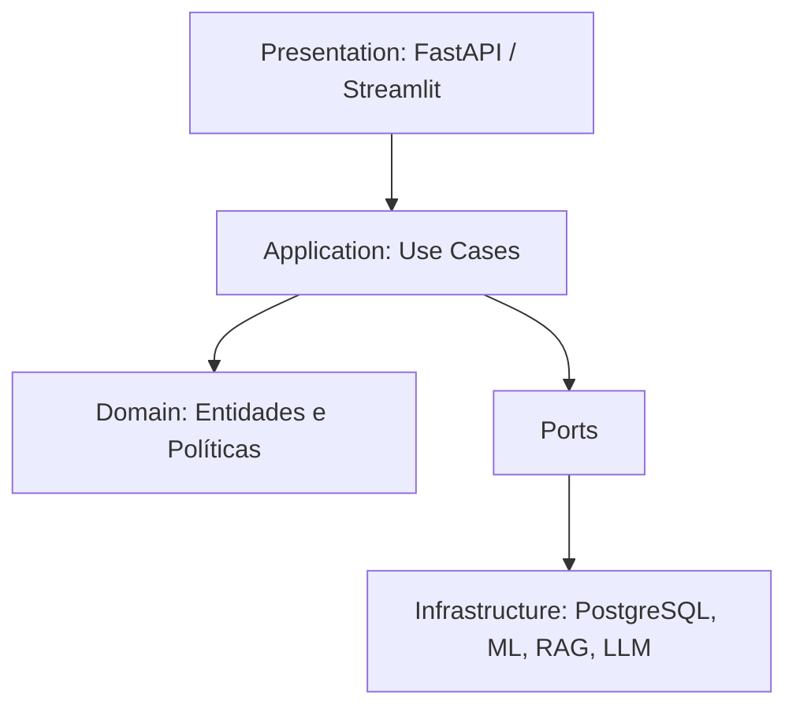
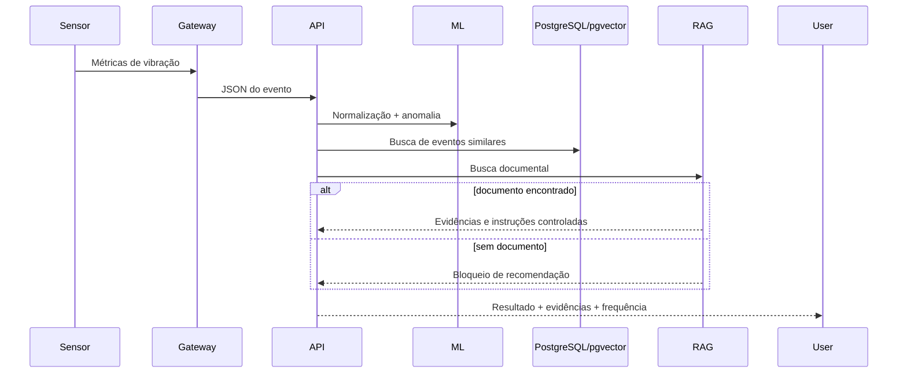

# Arquitetura Enterprise

## Visão de camadas

## Fluxo industrial

## Decisões

- `PostgreSQL + pgvector`: reduz complexidade operacional e centraliza histórico, JSONB e embeddings.
- `FastAPI`: contrato OpenAPI e validação forte.
- `Streamlit`: acelera a interação exigida no estudo de caso.
- `Isolation Forest`: adequado para detectar comportamento anômalo sem depender de rótulo completo.
- `RAG guardado`: responde somente com base nos documentos recuperados.
- `Unit of Work`: permite transações consistentes e testabilidade.
- `Redis/Celery`: preparado para indexação assíncrona e reprocessamentos.
- `Prometheus`: instrumentação mínima para operação.

## Produção

Para produção, recomenda-se:

- autenticação OIDC/AD;
- TLS/mTLS;
- API Gateway;
- segregação de rede OT/IT;
- fila Kafka/MQTT;
- PostgreSQL HA;
- MLflow;
- validação humana obrigatória;
- auditoria imutável;
- monitoramento de drift;
- revisão periódica dos documentos técnicos.
